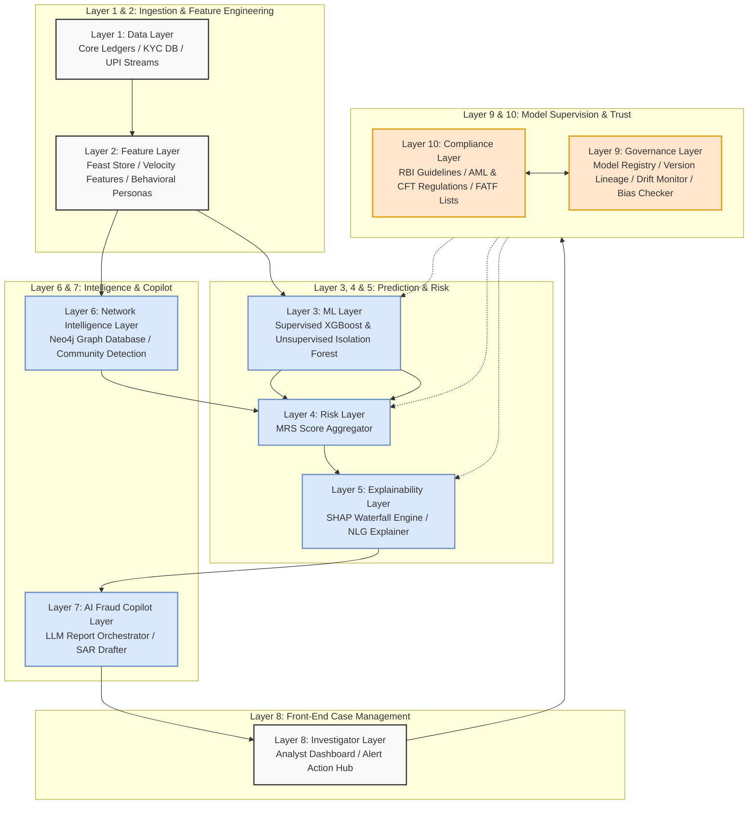
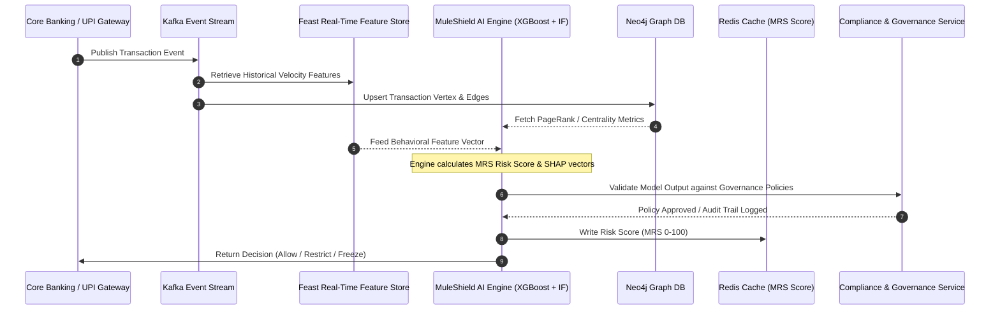
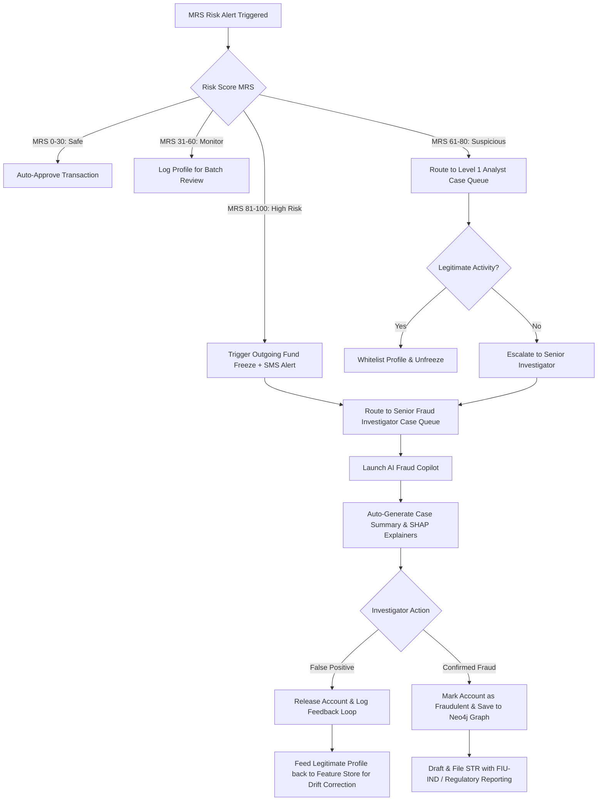
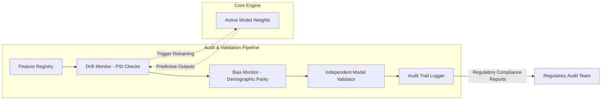
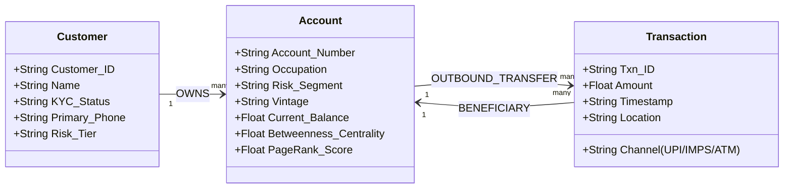

# MuleShield AI: Enterprise-Grade Architecture
This document details the architectural layout of the **MuleShield AI** platform, featuring visual Mermaid diagrams to demonstrate data flows, governance checks, investigator workflows, and network intelligence databases.

---

## SECTION 1: 10-Layer Enterprise Architecture

MuleShield AI is built as a microservices-based system divided into 10 distinct layers. Crucially, the **Governance** and **Compliance** layers sit above the Core AI modules to monitor model execution, ensure bias-free predictions, and provide standard audit trails.

---

## SECTION 2: Real-Time Data Flow Architecture

The data pipeline handles both low-latency transaction validation (e.g., UPI transfers) and batch-based historical analysis.

---

## SECTION 3: Case Management & Investigator Workflow

This diagram maps how a transaction flag is handled by the operational units of the bank, demonstrating the workflow from initial machine alert to final Suspicious Transaction Report (STR) filing.

---

## SECTION 4: Governance Layer Architecture

This layer manages feature registry tracking, population stability metrics, bias thresholds, and independent model validations.

---

## SECTION 5: Mule Network Discovery Engine Graph Schema

The network intelligence model organizes raw data into a Neo4j Graph schema to expose circular transfers and layering clusters.

* ** Louvain Community Detection**: Detects communities of accounts that frequently route money within dense sub-networks, signaling structured fraud syndicates.
* **Circle/Cycle Detection**: Identifies transactional paths where funds return to the sender account ($A \to B \to C \to A$) within a 24-hour window, bypassing traditional cash-flow surveillance.
